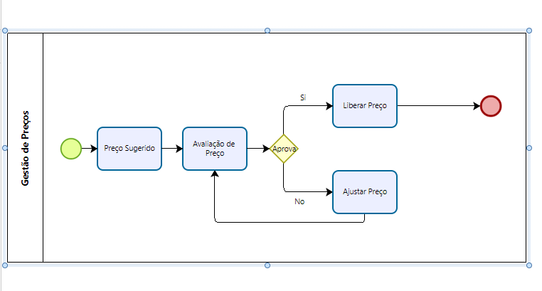

# Desafio DIO: Workflows de Preços com AWS Step Functions
# Anna Elizabeth Parra Rausseo
# https://github.com/annaeparrar/

> **Status:** Concluído

Este repositório documenta a prática de consolidação de workflows automatizados utilizando o **AWS Step Functions**, focado na criação de uma Máquina de Estado para **avaliação e aprovação iterativa de preços sugeridos**. O objetivo foi aplicar conceitos de lógica condicional (`Choice`) e reentrada de etapas (loops) dentro do fluxo.

---

## Objetivos

Durante a execução deste desafio, foquei em consolidar a minha compreensão e habilidade prática nos seguintes tópicos:

* **Modelagem de Processos Iterativos:** Utilizar o Step Functions para criar um ciclo de avaliação e ajuste (loop).
* **Lógica Condicional (Choice State):** Implementar regras de aprovação baseadas em variáveis de preço e critérios.
* **Orquestração de Microsserviços:** Integrar Lambdas para cálculo e ajuste de preços.
* **Resiliência do Workflow:** Garantir que o processo de ajuste e reavaliação seja seguro e rastreável.

---

## Conceitos e Insights Adquiridos

### Tipos de Estado e Lógica de Ciclo

A prática demonstrou como orquestrar um loop de ajuste, crucial para fluxos de aprovação de preços:

| Tipo de Estado | Função Principal no Workflow de Preços | Insight Chave |
| :--- | :--- | :--- |
| **Task** (`Preço Sugerido`) | Calcula um preço inicial com base em regras de negócio. | O preço gerado aqui (ex: `$.suggestedPrice`) torna-se o input para a próxima etapa. |
| **Task** (`Ajustar Preço`) | Aplica um algoritmo de ajuste quando a aprovação falha. | É essencial que esta tarefa retorne o novo preço e o contador de tentativas (`$.attempts`). |
| **Choice** (`Aprova?`) | Determina se o preço sugerido atende aos critérios de margem. | Define a ramificação: **Aprovar** (`Next: Libera Preço`) ou **Ajustar** (`Next: Ajustar Preço`). |
| **Succeed** (`Libera Preço`) | Marca o fim bem-sucedido do ciclo de aprovação. | Garante que o workflow se encerre quando um preço válido é alcançado. |

### Manipulação de Dados em Loops

No contexto deste fluxo, a manipulação de dados é crítica:

* **Persistência de Dados:** O Step Functions mantém o *state* (estado) do preço e das tentativas (`attempts`) em todo o loop, garantindo que as funções de ajuste e avaliação tenham os dados mais recentes.
* **ResultPath:** Deve ser usado para injetar o novo preço calculado no objeto de estado, permitindo que o `Choice State` o avalie na próxima iteração.

---

## Arquitetura Implementada

A Máquina de Estado criada simula o processo de aprovação de preços. A principal característica é o **loop condicional de ajuste**.

### Fluxo de Trabalho (Workflow)

1.  **Início**
2.  **Preço Sugerido (Task):** Invoca uma função Lambda para calcular o preço inicial.
3.  **Avaliação do Preço (Task):** Uma Lambda avalia o preço sugerido em relação a métricas de mercado/margem e retorna um sinal de **aprovação** (booleano).
4.  **Aprova? (Choice):**
    * **SE** APROVADO (`"BooleanEquals": true`): O fluxo vai para **`Libera Preço`**.
    * **SE** REJEITADO: O fluxo vai para **`Ajustar Preço`**.
5.  **Ajustar Preço (Task):** Uma Lambda aplica uma regra para aumentar/diminuir o preço.
6.  **Volta à Avaliação:** Após o ajuste, o fluxo **retorna à etapa `Avaliação do Preço`** para re-verificar o novo valor (o loop).
7.  **Libera Preço (Succeed):** Fim do workflow com sucesso.

### Diagrama do Workflow



---

## Detalhes da Implementação

### Trecho da Definição de Estado (ASL)

Aqui está um exemplo de como o loop de reavaliação é configurado usando a linguagem Amazon States Language:

```json
{
  "StartAt": "PrecoSugerido",
  "States": {
    "PrecoSugerido": {
      "Type": "Task",
      // ... (Detalhes da função de sugestão inicial)
      "Next": "AvaliacaoDoPreco"
    },
    "AvaliacaoDoPreco": {
      "Type": "Task",
      // ... (Detalhes da função de avaliação)
      "Next": "Aprova?"
    },
    "Aprova?": {
      "Type": "Choice",
      "Choices": [
        {
          "Variable": "$.approval", 
          "BooleanEquals": true,
          "Next": "LiberaPreco"
        }
      ],
      "Default": "AjustarPreco"
    },
    "AjustarPreco": {
      "Type": "Task",
      // ... (Detalhes da função de ajuste)
      "Next": "AvaliacaoDoPreco" // *** ESTE É O PONTO CHAVE DO LOOP ***
    },
    "LiberaPreco": {
      "Type": "Succeed"
    }
  }
}

